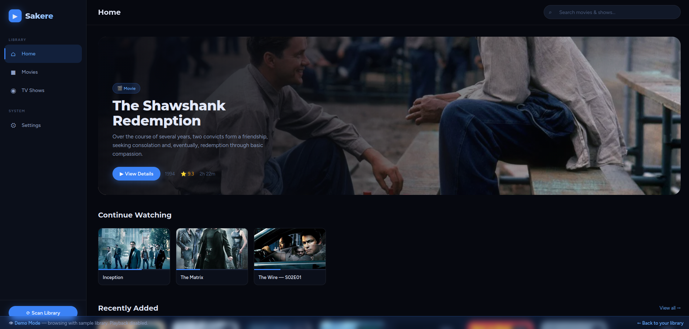
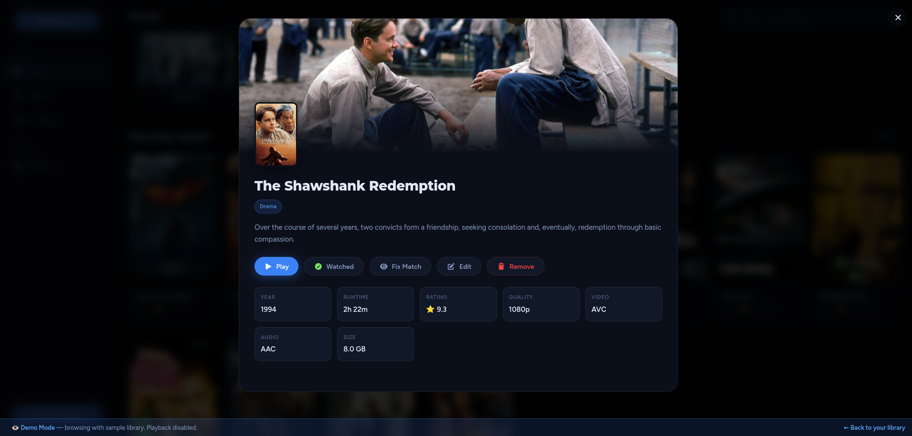
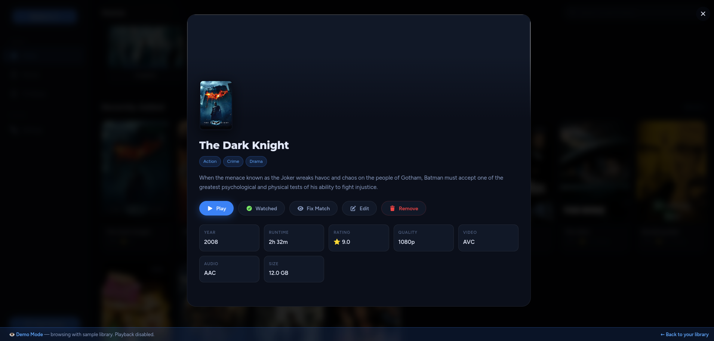
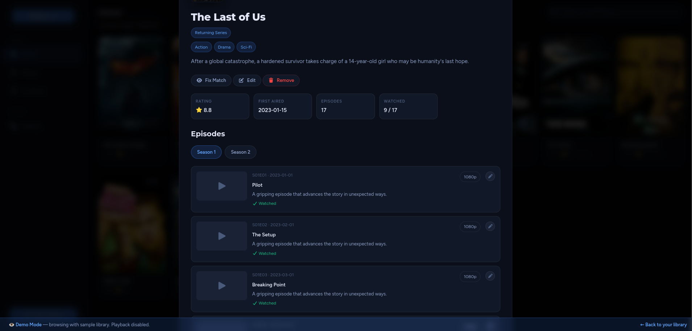
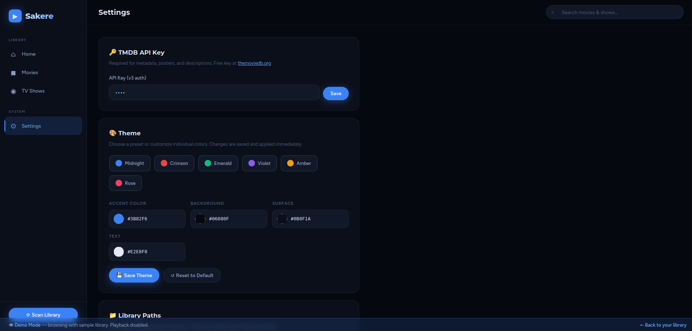
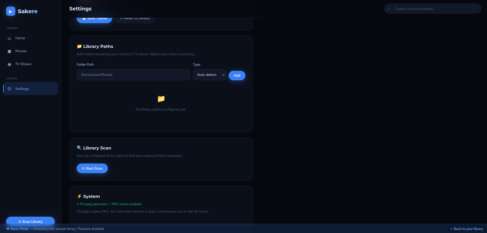
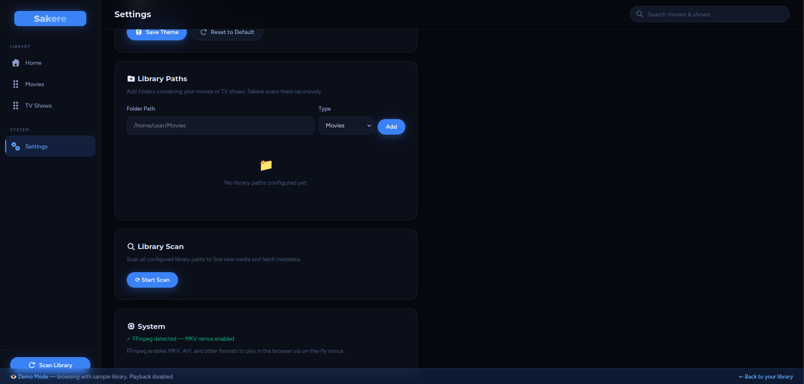
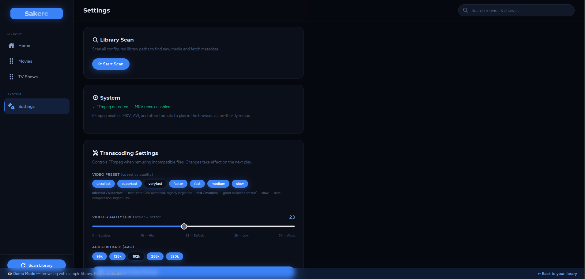

# 🎬 Sakere — Personal Media Center
---
A modern, self-hosted media center built with Python, FastAPI, and a sleek dark UI.

>IMPORTANT
>Update 2.3 out, several updates. Download the repo and make sure first thing to extract the /frontend/fonts.zip into the frontend directory where it sits.
>Then you can delete the fonts.zip and you should have a /fonts/ directory and index.html


## Features
- 🎬 Movies & 📺 TV Shows library with full metadata from TMDB
- 🔍 Smart filename parsing via `guessit` (handles S01E01, year detection, etc.)
- 📊 Technical metadata extraction via `pymediainfo` (codec, resolution, duration)
- ▶ In-browser streaming with byte-range support
- 💾 SQLite database — single file, no server needed
- 🌐 Cross-platform (Linux, macOS, Windows)
- 🖌️ Custom-Theme Accents/Color Options.
- 📑 Subtitle Support: WebVTT extraction for text subs and live burn-in for image-based subs (PGS/VOBSUB)
- 🔊 Audio/Sub Track Selection: includes a track-picker UI during playback.
- ⏭️ Continue Watching & Up Next: The frontend has built-in progress tracking and an "Up Next" autoplay countdown for TV shows.
- Etc.

## Local-first
<details>
<summary>Click to view</summary>
Data Sovereignty

    The Database: Your sakere.db is a SQLite file sitting right in your project folder. Unlike Plex, which stores your library metadata on their corporate servers, your watch history, file paths, and metadata stay on your hard drive.

    The Settings: Your settings.json (where your TMDB key and paths live) is also local.

2. Direct Streaming (No Middleman)

When you hit play in index.html, the frontend makes a request directly to your FastAPI backend (stream.py).

    How it works: Your computer talks to itself (localhost) or your TV talks to your computer over your home WiFi.

    The Benefit: Your video data never leaves your house. It doesn't travel to a "Sakere Cloud" and back down. This is why your 4K movies can start almost instantly—you're only limited by your router's speed, not your ISP's upload limit.

3. Minimal External Dependencies

The only time your server "calls home" to the internet is in matcher.py to talk to the TMDB API.

    It sends a movie title.

    It gets back a description and a poster URL.

    Everything else—the scanning, the transcoding, the technical metadata extraction (pymediainfo), and the UI serving—is handled entirely by your local Python environment.
</details>

Help?
---

Feel free & please pitch in what you can to improve it! The more the merrier!
If you pitch in please add yourself to the Contributors.md!

As of today the issues section, also has some need-to-do's/wants.

Default Theme (Demo Screenshots from v1.9)
---
You can get a slight feel at [Display-site](https://sakere-mc.web.app/) which looks like a blank library. 
Example display-site is now on v2.2.
<details>
  <summary>Click to see the screenshots!</summary>










</details>

## Quick Start

### 1. Install system dependency
```bash
# Linux (Ubuntu/Debian):
sudo apt install mediainfo ffmpeg

# Linux (Fedora/RHEL):
sudo dnf install mediainfo ffmpeg

# Linux (Arch):
sudo pacman -S mediainfo ffmpeg

# macOS (Homebrew):
brew install mediainfo ffmpeg

# Windows (Winget CLI):
winget install MediaArea.MediaInfo Gyan.FFmpeg

# Windows (Manual): 
# - MediaInfo: https://mediaarea.net/en/MediaInfo/Download
# - FFmpeg: https://ffmpeg.org/download.html#build-windows
```
> [!NOTE]
> Ensure **ffmpeg** and **mediainfo** are accessible in your system PATH. You can verify this by running `ffmpeg -version` in your terminal.

### 2. Install Python dependencies
```bash
pip install -r requirements.txt
```

### 3. Run
```bash
python run.py
```

Then open http://localhost:7575 in your browser.

### 4. Configure
1. Go to **Settings** in the sidebar
2. Enter your TMDB API key (free at https://www.themoviedb.org/settings/api)
3. Add your library paths (e.g. `/home/user/Movies`)
4. Click **Scan Library**

## Supported Formats
.mkv, .mp4, .avi, .m4v, .mov, .wmv, .flv, .m2ts, .ts, .webm, .mpg, .mpeg

## Notes on Playback
- **MP4/WebM**: Play natively in the browser, no transcoding needed
- **MKV and others**: On-the-fly remuxing and transcoding for unsupported video (HEVC/H.265) and audio (DTS, AC-3) formats

## Project Structure
```
sakere/
├── backend/
│   ├── main.py      # FastAPI routes
│   ├── database.py  # SQLAlchemy models
│   ├── scanner.py   # File scanning + metadata
│   ├── matcher.py   # TMDB API integration
│   ├── stream.py    # Video streaming
│   └── config.py    # Configuration
├── frontend/
│   └── index.html   # Full SPA frontend
├── run.py           # Entry point
└── requirements.txt
```


## ⚖️ Legal Disclaimer

Sakere is a tool designed for the organization and playback of personal media collections. 
- **No Media Provided:** Sakere does not provide, host, or distribute any media content. 
- **User Responsibility:** Users are solely responsible for ensuring they have the legal right to the content they add to their library.
- **Compliance:** The developers of Sakere do not condone or support the unauthorized use of copyrighted material.
